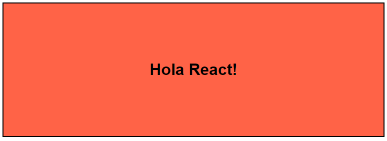

## Random-Box-React

En este ejercicio se tiene como finalidad  aplicar los conceptos bases de React.js 

Para ello se creo  un contenedor de texto dinamicamente desde read.js a través de jsx.
Utilizando además random de estilos que al cargar el navegador aleatoriamente cambie de tipo de texto y color de fondo.

#### Herramientas utilizadas

> HTML5

> CSS3

> REACT JS

> BABEL

### vista

